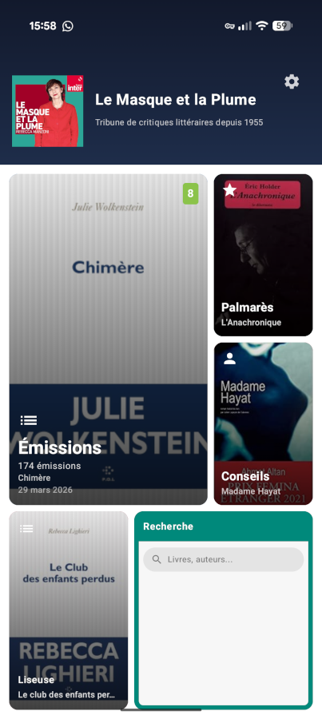

# lmelp-mobile


Application Android pour consulter le contenu de Le Masque et la Plume (LMELP) — émission littéraire de France Inter — hors connexion.

Un aperçu de sa page d'accueil :



## pyfoundry-template

Ce projet a été instancié depuis un template.

Toutes les infos sur ce template et la façon de l'utiliser sont dans sa [documentation](https://castorfou.github.io/PyFoundry/).


## Vision

Application mobile **standalone et offline-first** permettant de consulter :
- Les émissions avec leurs critiques et avis
- Le palmarès des livres
- La liste des critiques et leurs avis
- La recherche dans toute la base
- Les recommandations personnalisées (collaborative filtering SVD)

Les données sont **embarquées dans l'APK** (base SQLite) et mises à jour via un pipeline de publication en un clic.

## Architecture

```
back-office-lmelp (MongoDB)
        │
        ▼
scripts/export_mongo_to_sqlite.py
        │
        ▼
lmelp.db  (SQLite snapshot)
        │
        ▼  (copié dans app/src/main/assets/)
Application Android (Kotlin + Jetpack Compose + Room)
        │
        ▼
GitHub Actions → APK → GitHub Releases
```

## Stack technique

| Composant      | Technologie                     |
| -------------- | ------------------------------- |
| Langage        | Kotlin                          |
| UI             | Jetpack Compose                 |
| ORM            | Room (SQLite)                   |
| Navigation     | Navigation Compose              |
| Build          | Gradle (Kotlin DSL)             |
| CI/CD          | GitHub Actions                  |
| Distribution   | GitHub Releases                 |
| Export données | Python 3.11+ (pymongo → SQLite) |

## Fonctionnalités cibles

### V1 — Consultation offline

| Écran               | Description                                                                      |
| ------------------- | -------------------------------------------------------------------------------- |
| **Émissions**       | Liste des émissions avec date, durée, statut                                     |
| **Détail émission** | Livres discutés, critiques présents, avis par livre                              |
| **Palmarès**        | Livres classés par note moyenne décroissante                                     |
| **Critiques**       | Liste des 25 critiques avec leurs avis                                           |
| **Détail critique** | Tous les avis d'un critique avec notes                                           |
| **Recherche**       | Full-text search sur titres, auteurs, critiques                                  |
| **Recommandations** | Livres recommandés par collaborative filtering SVD                               |
| **Sur ma liseuse**  | Livres Calibre tagués `onkindle`, filtrés par virtual library, avec notes Masque |

### V2 — Mise à jour des données (à définir)

- Sync Wi-Fi avec le back-office si sur le même réseau
- Ou rebuild APK + GitHub Releases automatisé

## Setup développement

### Prérequis

- Android Studio Hedgehog ou supérieur
- JDK 17+
- Python 3.11+ avec `uv` (pour le script d'export)
- Accès à une instance MongoDB `masque_et_la_plume`

### Générer la base SQLite

```bash
# Installer les dépendances Python
uv pip install -e .

# Configurer l'environnement local (une seule fois)
cp scripts/.env.example scripts/.env
# Éditer scripts/.env avec mongo URI, chemin Calibre, virtual library

# Exporter MongoDB → SQLite
python scripts/export_mongo_to_sqlite.py --force

# Vérifier le résultat
python scripts/export_mongo_to_sqlite.py --verify app/src/main/assets/lmelp.db
```
### Lancer l'appli

```bash
# Ouvrir le projet dans Android Studio
# ou build en ligne de commande :
./gradlew assembleDebug
./gradlew installDebug
```

## Installation

Ce projet utilise **uv** pour la gestion des dépendances et des environnements Python.

# Créer un tag → déclenche GitHub Actions → build APK + release
git tag v1.0.0
git push origin v1.0.0
```

GitHub Actions va :
1. Exporter MongoDB → SQLite (si secrets configurés)
2. Builder l'APK signé
3. Publier dans GitHub Releases

Voir [docs/ci-cd.md](docs/ci-cd.md) pour la configuration.

### Avec VS Code + Devcontainer (Recommandé)

Si vous avez Docker et VS Code :

```bash
# 1. Authentifiez-vous à ghcr.io (si nécessaire)
# Créez un Personal Access Token : https://github.com/settings/tokens/new
# Permissions : read:packages
docker login ghcr.io -u VOTRE_USERNAME

# 2. Ouvrez dans VS Code
code .
# VS Code proposera "Reopen in Container"
```

## Structure du projet

```
├── app/                          # Application Android (Kotlin)
│   ├── src/main/
│   │   ├── assets/lmelp.db       # Base SQLite embarquée (générée)
│   │   ├── java/com/lmelp/mobile/
│   │   │   ├── data/             # Room entities, DAOs, Database
│   │   │   ├── ui/               # Composables Jetpack Compose
│   │   │   │   ├── emissions/
│   │   │   │   ├── palmares/
│   │   │   │   ├── critiques/
│   │   │   │   ├── search/
│   │   │   │   └── recommendations/
│   │   │   ├── viewmodel/        # ViewModels
│   │   │   └── MainActivity.kt
│   │   └── res/
│   └── build.gradle.kts
├── scripts/
│   └── export_mongo_to_sqlite.py # Export MongoDB → SQLite
├── docs/
│   ├── architecture.md           # Architecture détaillée
│   ├── data-schema.md            # Schéma SQLite
│   └── ci-cd.md                  # Pipeline CI/CD
├── .github/workflows/
│   └── release.yml               # Build + publish APK
├── pyproject.toml                # Dépendances Python (script export)
├── CLAUDE.md                     # Guide pour Claude Code
└── README.md
```


## Source des données

Les données proviennent du projet [back-office-lmelp](https://github.com/castorfou/back-office-lmelp) :
- **227 émissions** de Le Masque et la Plume
- **1615 livres** discutés
- **1114 auteurs**
- **25 critiques**
- **4100+ avis** avec notes (1-10)


## Documentation

📚 La documentation complète est disponible sur [castorfou.github.io/lmelp-mobile](https://castorfou.github.io/lmelp-mobile)

### Activer GitHub Pages (première fois)

Pour déployer la documentation, activez GitHub Pages :

```bash
# Via gh CLI (recommandé)
gh api repos/castorfou/lmelp-mobile/pages \
  -X POST \
  -f build_type=workflow

# Ou manuellement :
# 1. Allez dans Settings > Pages
# 2. Source : sélectionnez "GitHub Actions"
```

### Générer localement

```bash
# Installer les dépendances de documentation
uv sync --extra docs

# Prévisualiser localement
uv run mkdocs serve

# La documentation sera accessible à l'URL affichée dans les logs
# Example: http://127.0.0.1:8000/lmelp-mobile/
```

!!! note "URL locale"
    Comme `site_url` est configuré pour GitHub Pages avec un chemin de base,
    MkDocs servira la documentation avec ce même chemin en local.
    Accédez à l'URL complète affichée dans les logs (avec le chemin `/lmelp-mobile/`).

    Si vous souhaitez servir sans chemin de base pour le développement local,
    commentez temporairement la ligne `site_url` dans `mkdocs.yml`.

## Usage

Décrivez ici comment utiliser votre projet.

## Contribution

1. Installez les hooks pre-commit : `pre-commit install`
2. Créez une branche pour votre fonctionnalité
3. Commitez vos changements
4. Ouvrez une Pull Request
