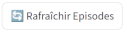
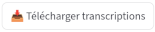

## Ajouter l'épisode à la base de données LMELP

à la diffusion d'un nouvel épisode de l'émission, j'ai pas mal de boulot :

>  depuis **lmelp-frontoffice** :
>
> -  télécharge l'enregistrement audio dans `docker-lmelp/data/audios`
>
>  transcription de l'épisode
>
> ??? info "mode d'emploi"
>     manuellement depuis une machine **GPU avec whisper** en fournissant le `.m4a` depuis `docker-lmelp/data/audios`, et en retour copie du fichier `.txt` dans `docker-lmelp/data/audios`
>
>  depuis **lmelp-frontoffice**:
>
> -  charge le fichier de transcription (gestion de cache) dans le champ transcription de l'épisode (mongo/episodes)
>
>  depuis **lmelp-backoffice** - frontend :
>
> -  page **Génération Avis Critiques (LLM)** : crée un summary depuis la transcription d'un épisode.
> Note: cliquer sur **Episodes sans Avis Critiques** dans la zone Informations générales dans la zone Informations générales nous améne à cette page
> -  page **Livres et Auteurs** : extrait les livres/auteurs de l'épisode sur la base du summary et se base sur les metadonnées babelio (il faut au préalable lancer un VPN système (pas browser), et valider le captcha d'accès [babelio](https://www.babelio.com/)) pour corriger les titres/auteurs/éditeurs.
> Note: cliquer sur **Avis Critiques sans Analyse** dans la zone Informations générales nous amène à cette page
> -  **Identification des Critiques** : nécessaire si un critique participe pour la 1ère fois à l'émission
> -  **Liaison Babelio** : pour lier les oeuvres / auteurs à leurs pages babelio respectives, ainsi que le lien vers la couverture de l'oeuvre.
>  Note: cliquer sur **Livres sans lien Babelio** / **Auteurs sans lien Babelio** dans la zone Informations générales nous amène à cette page
> -  **Emissions** : visu du resultat de l'émission structurée : toutes les oeuvres doivent aparaitre identifiées, notées
>  Note: cliquer sur **Emissions avec Problème** dans la zone Informations générales nous amène à cette page


à l'issue de tout cela la base de données a été enrichie avec ce nouvel episode

## Intégrer la nouvelle base de données LMELP à l'application mobile

Le logiciel lmelp-mobile ne change pas, seule la base de données évolue.

### Pré-requis

- adb est installé et [fonctionnel](#en-cas-de-problème-adb)
- Le téléphone est branché en USB au laptop
- Le débogage USB est activé (Paramètres → Options développeur)
- La stack docker-lmelp est démarrée (en suivant [Déploiement avec Portainer](https://castorfou.github.io/docker-lmelp/user/portainer/), les conteneurs `lmelp-mongo` et `lmelp-export` doivent tourner)

### Commande unique

```bash
lmelp-update-mobile
```

Le script `scripts/lmelp-update-mobile.sh` (à copier une fois sur le laptop dans `~/bin/`) fait tout :

1. Redémarre le daemon ADB en mode réseau (`0.0.0.0:5037`)
2. Vérifie qu'un téléphone est connecté
3. Vérifie que le container `lmelp-export` tourne
4. Lance l'export MongoDB → SQLite (avec données Calibre pour le filtre "Lus")
5. Vérifie l'intégrité de la base
6. Pousse la base sur le téléphone via ADB
7. Redémarre l'app Android

### Installation du script (une seule fois)

```bash
cp scripts/lmelp-update-mobile.sh ~/bin/lmelp-update-mobile
chmod +x ~/bin/lmelp-update-mobile
```

### Démarrer le container lmelp-export

Il y a 3 niveaux selon l'avancement de la configuration :

**Niveau 1 — image locale (dev/test)** : image buildée localement depuis le repo

```bash
# depuis le repo lmelp-mobile
docker build -f Dockerfile.export -t lmelp-mobile-export:local .
docker run -d --name lmelp-export \
  --network lmelp-stack_lmelp-network \
  --add-host host-gateway:host-gateway \
  -v "/home/guillaume/Calibre Library:/calibre:ro" \
  -e LMELP_MONGO_URI=mongodb://mongo:27017 \
  -e LMELP_CALIBRE_DB=/calibre/metadata.db \
  -e LMELP_CALIBRE_VIRTUAL_LIBRARY=guillaume \
  -e ADB_HOST=host-gateway \
  -e ADB_PORT=5037 \
  lmelp-mobile-export:local
```

**Niveau 2 — image ghcr.io (usage normal en attendant docker-lmelp#41)** : image publiée automatiquement par la CI, gérée par Watchtower

```bash
docker run -d --name lmelp-export \
  --network lmelp-stack_lmelp-network \
  --add-host host-gateway:host-gateway \
  -v "/home/guillaume/Calibre Library:/calibre:ro" \
  -e LMELP_MONGO_URI=mongodb://mongo:27017 \
  -e LMELP_CALIBRE_DB=/calibre/metadata.db \
  -e LMELP_CALIBRE_VIRTUAL_LIBRARY=guillaume \
  -e ADB_HOST=host-gateway \
  -e ADB_PORT=5037 \
  --label "com.centurylinklabs.watchtower.enable=true" \
  ghcr.io/castorfou/lmelp-mobile-export:latest
```

**Niveau 3 — intégré à la stack docker-lmelp (cible finale)** : le container démarre automatiquement avec `docker compose up -d`, voir [docker-lmelp#41](https://github.com/castorfou/docker-lmelp/issues/41).

### En cas de problème ADB

Si `adb devices` ne voit pas le téléphone :

- Vérifier que le mode USB est sur **Transfert de fichiers**
- Valider la popup "Autoriser le débogage USB" sur le téléphone
- En dernier recours : `adb kill-server && adb -a start-server`

Voir aussi [docs/dev/build_deploy_apk.md](../dev/build_deploy_apk.md) pour le diagnostic complet.
